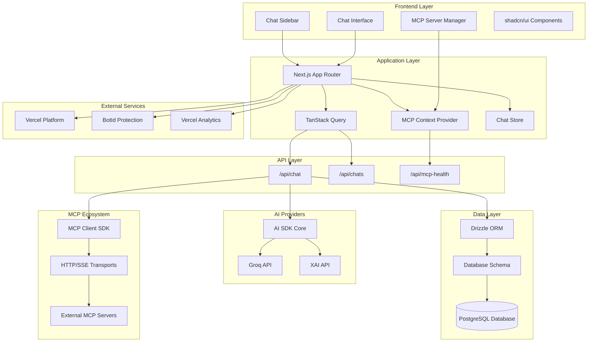
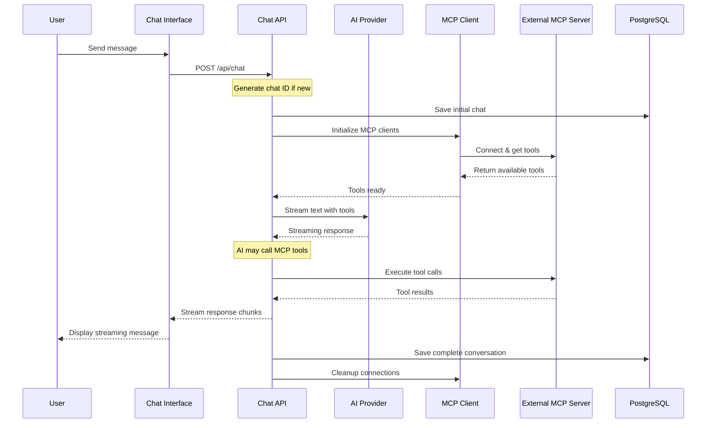
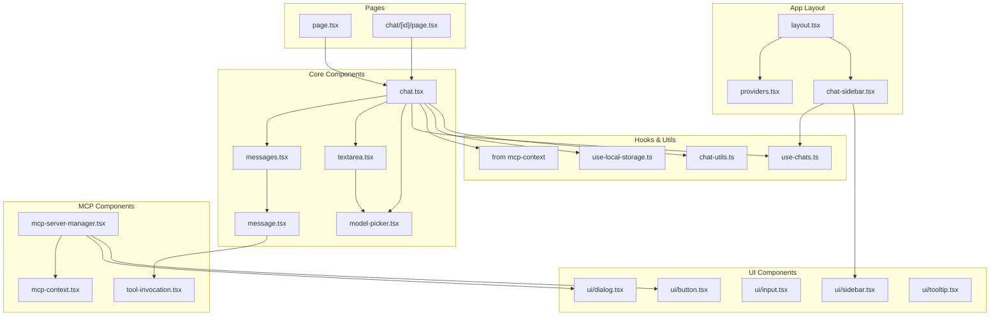
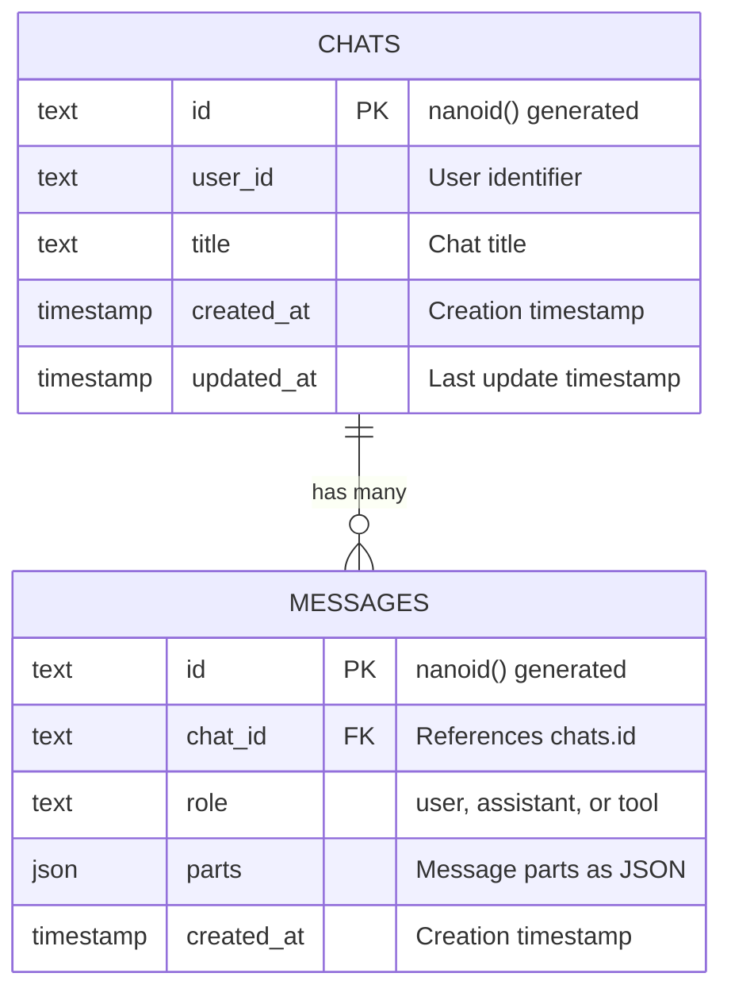
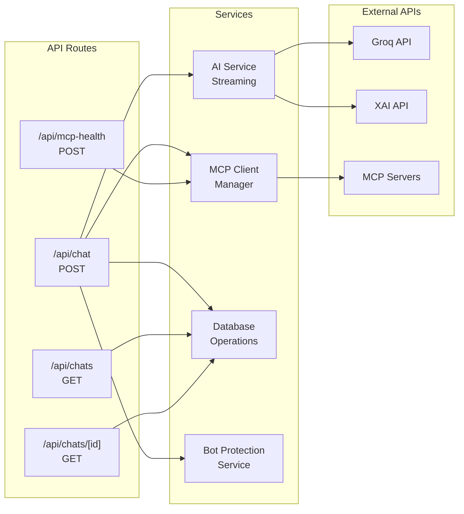

# MCP Chat Repository Architecture Analysis

## Background

**Scira MCP Chat** is an open-source AI chatbot application that integrates with the Model Context Protocol (MCP). Built with Next.js and the AI SDK by Vercel, it provides a modern, responsive chat interface that can connect to multiple AI providers and extend capabilities through MCP servers.

### Key Features:
- **Multi-AI Provider Support**: Integrates with Groq, XAI, and other providers via AI SDK
- **Model Context Protocol Integration**: Connects to external MCP servers for enhanced tool capabilities
- **Real-time Streaming**: Supports streaming responses with smooth text animation
- **Persistent Storage**: PostgreSQL database with Drizzle ORM for chat history
- **Modern UI**: Built with shadcn/ui components and Tailwind CSS
- **Bot Protection**: Integrated bot detection via BotId

## Technology Stack

- **Frontend**: Next.js 15 (App Router), React 19, TypeScript
- **Styling**: Tailwind CSS 4, shadcn/ui components
- **Database**: PostgreSQL with Drizzle ORM
- **AI Integration**: Vercel AI SDK, Model Context Protocol
- **State Management**: TanStack Query, React Context
- **Authentication**: BotId protection
- **Deployment**: Vercel (with analytics and speed insights)

## High-Level Architecture



## Data Flow Architecture



## Component Architecture



## Database Schema



## API Architecture



## Core Code Details

### 1. Chat Flow Implementation

The chat functionality is implemented through several key files:

#### **`components/chat.tsx`** (Main Chat Component)
```typescript
// Key features:
- useChat hook from AI SDK for streaming responses
- React Query for chat history management
- MCP context integration for external tools
- Dynamic chat ID generation for new conversations
- Real-time message streaming with error handling
```

#### **`app/api/chat/route.ts`** (Chat API Endpoint)
```typescript
// Core responsibilities:
- Bot protection via BotId
- MCP client initialization with tool discovery
- AI model selection and streaming configuration
- Database persistence of conversations
- Error handling and cleanup
```

### 2. MCP Integration

#### **`lib/mcp-client.ts`** (MCP Client Manager)
```typescript
// Key functionality:
- Support for HTTP and SSE transports
- Dynamic MCP server configuration
- Tool discovery and management
- Connection lifecycle management
- Error handling and fallback strategies
```

#### **`lib/context/mcp-context.tsx`** (MCP State Management)
```typescript
// Features:
- MCP server configuration storage
- Server health monitoring
- Tool discovery and caching
- Connection status management
- Local storage persistence
```

### 3. Database Layer

#### **`lib/db/schema.ts`** (Database Schema)
```typescript
// Schema design:
- Chats: User sessions with metadata
- Messages: Chat messages with JSON parts
- Support for rich message content (text, tools, attachments)
- Cascading deletes for data integrity
```

#### **`lib/chat-store.ts`** (Database Operations)
```typescript
// Key operations:
- Message format conversion (UI ↔ DB)
- Automatic title generation
- Chat history persistence
- Message part handling for complex content
```

### 4. AI Provider Integration

#### **`ai/providers.ts`** (AI Provider Configuration)
```typescript
// Supported providers:
- Groq: Multiple models (Qwen, Kimi, Llama)
- XAI: Grok models
- Custom provider wrapper with reasoning middleware
- Dynamic API key management (env vars + localStorage)
```

### 5. State Management

The application uses a hybrid state management approach:

- **React Query**: Server state and caching for chats and messages
- **React Context**: MCP server configuration and status
- **Local Storage**: User preferences and API keys
- **URL State**: Current chat ID and navigation

### 6. Security Features

- **Bot Protection**: BotId integration to prevent automated abuse
- **Input Validation**: Zod schemas for API validation
- **Secure Headers**: Environment variable prioritization over localStorage
- **Error Boundaries**: Graceful error handling throughout the app

### 7. Performance Optimizations

- **Streaming Responses**: Real-time AI response streaming
- **Query Caching**: TanStack Query for efficient data fetching
- **Component Lazy Loading**: Code splitting for better initial load
- **Message Virtualization**: Efficient rendering of long conversations
- **Connection Pooling**: Reuse of MCP connections

## Key Architectural Decisions

1. **Next.js App Router**: Modern routing with server components where beneficial
2. **Model Context Protocol**: Extensible tool integration architecture
3. **AI SDK Integration**: Provider-agnostic AI model support
4. **PostgreSQL + Drizzle**: Type-safe database operations with good performance
5. **Component-First Design**: Reusable UI components with shadcn/ui
6. **Real-time Updates**: Streaming responses with optimistic UI updates

This architecture provides a scalable, maintainable foundation for an AI chat application with extensive customization capabilities through MCP server integration.
