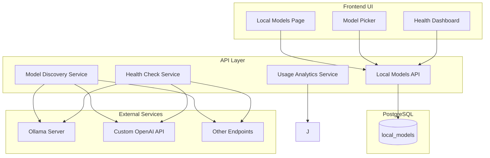
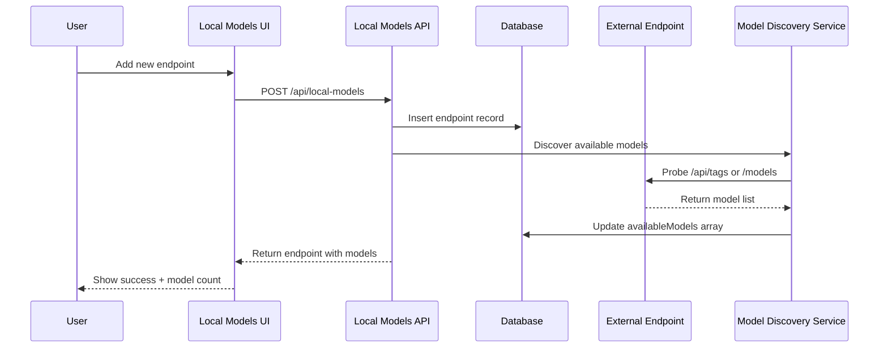
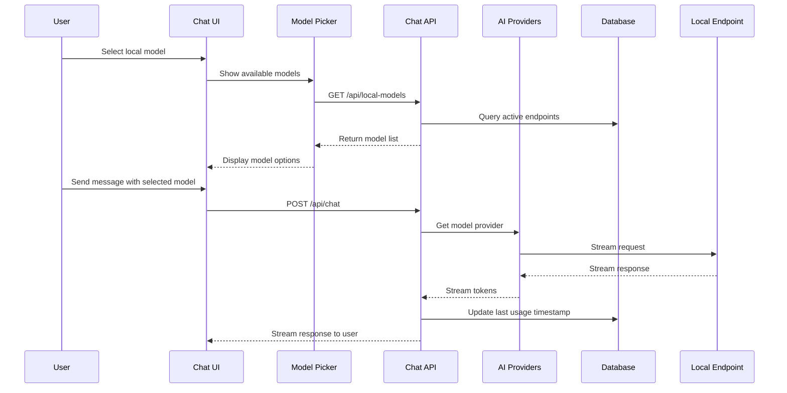
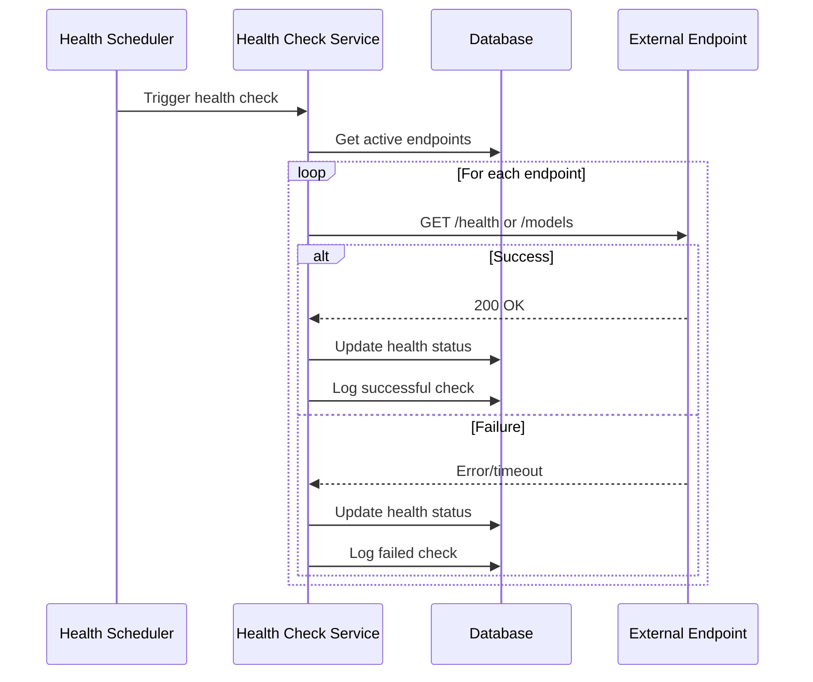

# Local Models Database Design

This document outlines the design for migrating local models from localStorage to a database-backed system with full CRUD operations.

## Overview

The current system stores local model configurations in browser localStorage, which limits:
- Multi-device access
- User collaboration
- Data persistence across sessions
- Audit trails and history

The new design moves to a PostgreSQL database with proper relationships, user ownership, and API endpoints for all CRUD operations.

---

## Database Schema

### Single Table Design

```sql
-- Local model endpoints with embedded model information
CREATE TABLE local_models (
  id TEXT PRIMARY KEY DEFAULT nanoid(),
  user_id TEXT NOT NULL REFERENCES users(id) ON DELETE CASCADE,
  name TEXT NOT NULL,
  base_url TEXT NOT NULL,
  api_key TEXT, -- encrypted
  is_active BOOLEAN DEFAULT false,
  endpoint_type TEXT NOT NULL DEFAULT 'ollama', -- 'ollama', 'openai-compatible', 'custom'
  health_status TEXT DEFAULT 'unknown', -- 'healthy', 'unhealthy', 'unknown'
  last_health_check TIMESTAMP,
  available_models JSONB DEFAULT '[]', -- Array of model strings, e.g. ['qwen2:7b', 'llama3:8b']
  last_model_discovery TIMESTAMP,
  created_at TIMESTAMP DEFAULT NOW(),
  updated_at TIMESTAMP DEFAULT NOW()
);

-- Index for efficient queries
CREATE INDEX idx_local_models_user_active ON local_models(user_id, is_active);
CREATE INDEX idx_local_models_health ON local_models(health_status, last_health_check);
```

### Updated Schema File

```typescript
// lib/db/schema.ts additions

export const localModels = pgTable('local_models', {
  id: text('id').primaryKey().notNull().$defaultFn(() => nanoid()),
  userId: text('user_id').notNull().references(() => users.id, { onDelete: 'cascade' }),
  name: text('name').notNull(),
  baseUrl: text('base_url').notNull(),
  apiKey: text('api_key'), // encrypted
  isActive: boolean('is_active').default(false),
  endpointType: text('endpoint_type').notNull().default('ollama'),
  healthStatus: text('health_status').default('unknown'),
  lastHealthCheck: timestamp('last_health_check'),
  availableModels: jsonb('available_models').$type<string[]>().default([]),
  lastModelDiscovery: timestamp('last_model_discovery'),
  createdAt: timestamp('created_at').defaultNow().notNull(),
  updatedAt: timestamp('updated_at').defaultNow().notNull(),
});

// Type for the table
export type LocalModel = typeof localModels.$inferSelect;
export type NewLocalModel = typeof localModels.$inferInsert;
```

---

## API Design

### RESTful Endpoints

```typescript
// app/api/local-models/route.ts - List and Create
GET  /api/local-models          // List user's endpoints
POST /api/local-models          // Create new endpoint

// app/api/local-models/[id]/route.ts - Read, Update, Delete
GET    /api/local-models/[id]   // Get endpoint details
PUT    /api/local-models/[id]   // Update endpoint
DELETE /api/local-models/[id]   // Delete endpoint

// app/api/local-models/[id]/models/route.ts - Model discovery
GET    /api/local-models/[id]/models     // List available models
POST   /api/local-models/[id]/models     // Refresh models

// app/api/local-models/[id]/health/route.ts - Health monitoring
GET    /api/local-models/[id]/health     // Check endpoint health
POST   /api/local-models/[id]/health     // Trigger health check

// app/api/local-models/[id]/usage/route.ts - Usage analytics
GET    /api/local-models/[id]/usage      // Get usage statistics
```

### Request/Response Types

```typescript
// Create/Update endpoint
interface LocalModelRequest {
  name: string;
  baseUrl: string;
  apiKey?: string;
  endpointType?: 'ollama' | 'openai-compatible' | 'custom';
}

interface LocalModelResponse {
  id: string;
  name: string;
  baseUrl: string;
  apiKey?: string;
  isActive: boolean;
  endpointType: string;
  healthStatus: string;
  lastHealthCheck?: string;
  availableModels: string[];
  lastModelDiscovery?: string;
  createdAt: string;
  updatedAt: string;
}

// Health check response
interface HealthCheckResponse {
  status: 'healthy' | 'unhealthy' | 'unknown';
  responseTimeMs?: number;
  errorMessage?: string;
  lastChecked: string;
  availableModels: number;
}
```

---

## Architecture Overview



---

## Data Flow and Workflow

### 1. Endpoint Management Flow



### 2. Model Selection and Usage Flow



### 3. Health Monitoring Flow



---

## Implementation Phases

### Phase 1: Database Schema & Migration
- [ ] Create single local_models table
- [ ] Write migration script
- [ ] Update schema types
- [ ] Add database indexes

### Phase 2: API Layer
- [ ] Implement CRUD endpoints
- [ ] Add model discovery service
- [ ] Implement health checking
- [ ] Add basic usage tracking (last usage timestamp)

### Phase 3: Frontend Integration
- [ ] Update local models page to use API
- [ ] Modify model picker to fetch from API
- [ ] Add health status indicators
- [ ] Implement real-time updates

### Phase 4: Advanced Features
- [ ] Add usage analytics dashboard
- [ ] Implement endpoint performance metrics
- [ ] Add model recommendation system
- [ ] Implement automatic failover
- [ ] Add detailed usage tracking if needed

---

## Key Benefits

1. **Persistence**: Models survive browser sessions and device changes
2. **Collaboration**: Multiple users can share endpoint configurations
3. **Monitoring**: Health checks and usage analytics
4. **Scalability**: Database-backed system can handle many endpoints
5. **Security**: API keys stored encrypted in database
6. **Audit Trail**: Complete history of endpoint changes and usage

---

## Migration Strategy

### From localStorage to Database
1. **Backup**: Export current localStorage config
2. **Import**: Create database records from existing config
3. **Dual Write**: Write to both systems during transition
4. **Switch**: Update frontend to use API instead of localStorage
5. **Cleanup**: Remove localStorage dependency

### Data Migration Script
```typescript
// scripts/migrate-local-models.ts
async function migrateLocalModels() {
  const storedModels = localStorage.getItem('local-openai-models');
  if (!storedModels) return;

  const models = JSON.parse(storedModels);
  
  for (const model of models) {
    await createLocalModel({
      name: model.name,
      baseUrl: model.baseUrl,
      apiKey: model.apiKey,
      isActive: model.isActive,
      endpointType: 'ollama', // default
      availableModels: model.availableModels || []
    });
  }
}
```

---

## Security Considerations

1. **API Key Encryption**: Store sensitive keys encrypted at rest
2. **User Isolation**: Users can only access their own endpoints
3. **Rate Limiting**: Prevent abuse of health check endpoints
4. **Input Validation**: Sanitize all endpoint URLs and names
5. **Audit Logging**: Track all endpoint modifications

---

## Performance Optimizations

1. **Caching**: Cache endpoint health status and model lists
2. **Indexing**: Add indexes on frequently queried fields
3. **Pagination**: Implement pagination for large model lists
4. **Background Jobs**: Health checks and model discovery as background tasks
5. **Connection Pooling**: Reuse database connections efficiently
