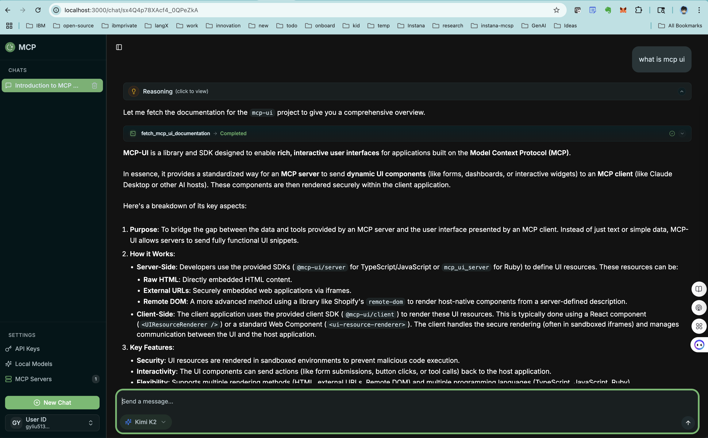

# Running MCP Chat with Docker

This guide explains how to run MCP Chat and its PostgreSQL database using Docker Compose.

## Prerequisites

- [Docker](https://docs.docker.com/get-docker/)
- [Docker Compose](https://docs.docker.com/compose/install/)

## Setup

1. Clone the repository:
   ```bash
   git clone https://github.com/aichestra/mcp-chat.git
   cd mcp-chat
   ```

2. Create a `.env.local` file from the example:
   ```bash
   cp .env.local.example .env.local
   ```

3. (Optional) Edit the `.env.local` file to add your API keys if needed.

## Running the Application

Start the application and database:

```bash
docker-compose up
```

This will:
- Start a PostgreSQL database container with a database named "mcpchat"
- Build and start the MCP Chat application
- Run database migrations automatically before starting the application
- Connect the application to the database

The application will be available at http://localhost:3000



## Database Initialization

The Docker Compose setup handles database initialization automatically:

1. PostgreSQL creates the "mcpchat" database when the container first starts (via the POSTGRES_DB environment variable)
2. The application container runs `pnpm db:migrate` before starting the application to set up all required tables

If you need to manually run migrations:

```bash
docker-compose exec mcp-chat pnpm db:migrate
```

## Development Mode

For development with hot reloading:

```bash
# Start only the PostgreSQL database
docker-compose up postgres

# In another terminal, run the database migrations
pnpm db:migrate

# Then run the application in development mode
pnpm dev
```

## Database Management

### Accessing the PostgreSQL Database

```bash
docker-compose exec postgres psql -U mcpuser -d mcpchat
```

### Running Database Migrations

```bash
# With the containers running
docker-compose exec mcp-chat pnpm db:migrate

# Or from your local machine (if you have pnpm installed)
pnpm db:migrate
```

### Viewing Database with Drizzle Studio

```bash
# With the containers running
docker-compose exec mcp-chat pnpm db:studio

# Or from your local machine
pnpm db:studio
```

## Stopping the Application

```bash
docker-compose down
```

To remove all data (including the database volume):

```bash
docker-compose down -v
```

## Troubleshooting

### Database Connection Issues

If the application can't connect to the database, ensure:

1. The PostgreSQL container is running:
   ```bash
   docker-compose ps
   ```

2. The DATABASE_URL environment variable is correctly set in your `.env.local` file.

3. Try restarting the containers:
   ```bash
   docker-compose restart
   ```

### Application Build Issues

If there are issues with the application build:

1. Check the logs:
   ```bash
   docker-compose logs mcp-chat
   ```

2. Try rebuilding the container:
   ```bash
   docker-compose build --no-cache mcp-chat
   ```

### Migration Issues

If you encounter issues with database migrations:

1. Check the migration logs:
   ```bash
   docker-compose logs mcp-chat
   ```

2. Try running migrations manually:
   ```bash
   docker-compose exec mcp-chat pnpm db:migrate
   ```

3. For a clean start, remove the database volume and restart:
   ```bash
   docker-compose down -v
   docker-compose up